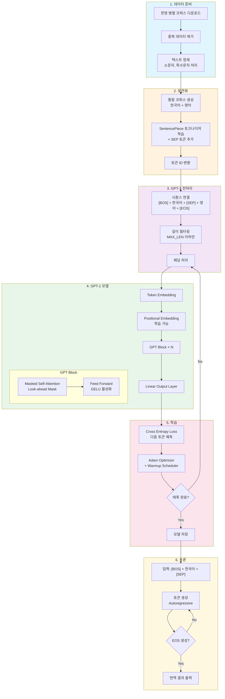
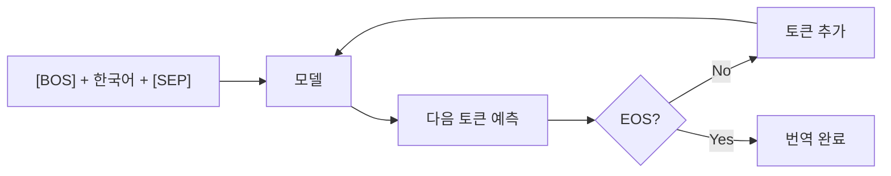
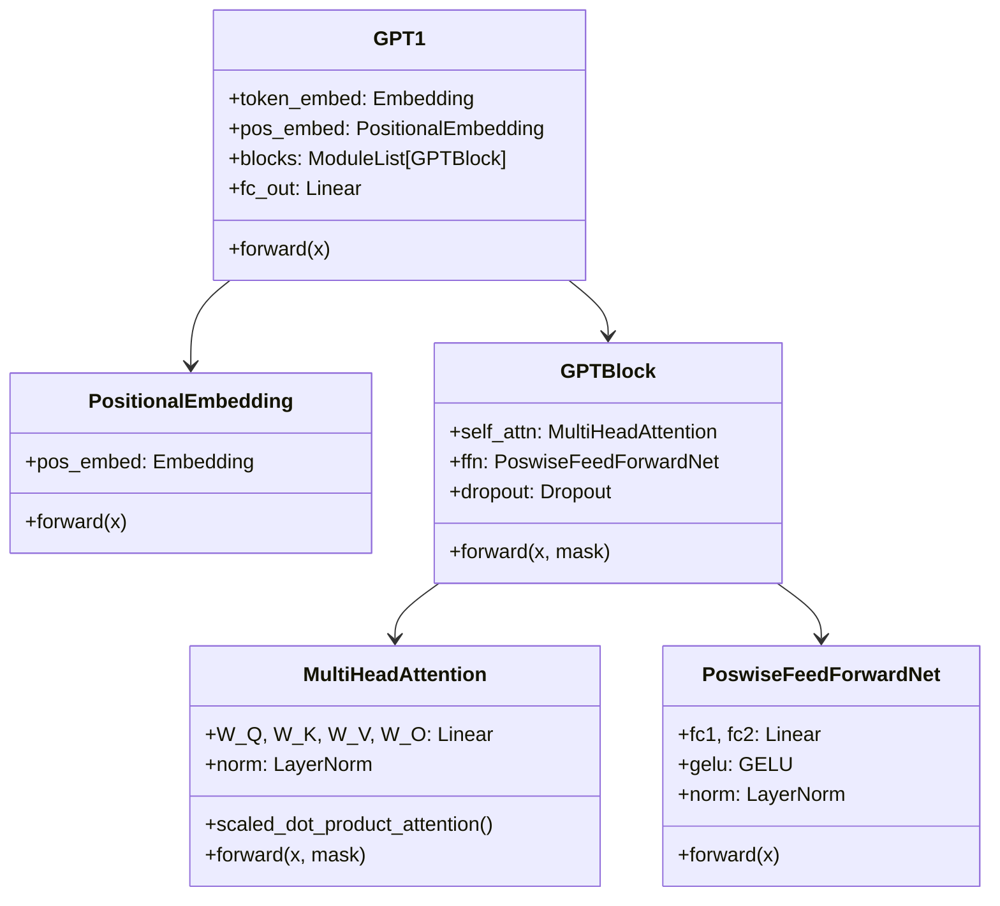

# GPT-1 기반 한국어 → 영어 번역기

> 기존 Transformer 번역기를 GPT-1 아키텍처로 변환한 프로젝트입니다.

## 목차
1. [프로젝트 개요](#프로젝트-개요)
2. [Transformer vs GPT-1 비교](#transformer-vs-gpt-1-비교)
3. [전체 프로세스 흐름도](#전체-프로세스-흐름도)
4. [세부 프로세스 설명](#세부-프로세스-설명)
5. [모델 아키텍처](#모델-아키텍처)
6. [실행 방법](#실행-방법)

---

## 프로젝트 개요

이 프로젝트는 Encoder-Decoder 구조의 Transformer 번역기를 **Decoder-only 구조의 GPT-1**으로 변환합니다.

### 주요 변경사항
- **인코더 제거**: Decoder-only 구조 채택
- **Cross-Attention 제거**: Self-Attention만 반복 사용
- **Positional Encoding → Positional Embedding**: 학습 가능한 위치 임베딩
- **ReLU → GELU**: 활성화 함수 변경
- **Look-ahead Mask**: 단방향 마스킹만 사용

---

## Transformer vs GPT-1 비교

| 구분 | Transformer | GPT-1 |
|------|-------------|-------|
| **구조** | Encoder-Decoder | Decoder-only |
| **인코더** | 있음 | 없음 |
| **Cross-Attention** | 디코더에서 인코더 참조 | 없음 |
| **Self-Attention** | 인코더/디코더 각각 | 반복 사용 |
| **위치 정보** | Sinusoidal Encoding (고정) | Learnable Embedding (학습) |
| **활성화 함수** | ReLU | GELU |
| **마스킹** | 양방향(Enc) + 단방향(Dec) | Look-ahead만 |
| **입력 형태** | src → Encoder, tgt → Decoder | 단일 시퀀스 |

---

## 전체 프로세스 흐름도



---

## 세부 프로세스 설명

### 1. 데이터 준비
```
한영 병렬 코퍼스 (94,123쌍)
    ↓ 중복 제거
정제된 데이터 (78,941쌍)
    ↓ 텍스트 정제
깨끗한 코퍼스
```

- **데이터 소스**: [korean-parallel-corpora](https://github.com/jungyeul/korean-parallel-corpora)
- **정제 과정**: 소문자 변환, 허용 문자만 유지, 문장부호 처리

### 2. 토큰화

**[GPT-1 변경점]** 한국어와 영어를 **통합 토크나이저**로 처리

```
기존 Transformer:
  - ko_tokenizer (한국어 전용)
  - en_tokenizer (영어 전용)

GPT-1:
  - tokenizer (한국어 + 영어 통합)
  - SEP 토큰 추가
```

**특수 토큰**:
| 토큰 | ID | 용도 |
|------|-----|------|
| `<PAD>` | 0 | 패딩 |
| `<BOS>` | 1 | 시퀀스 시작 |
| `<EOS>` | 2 | 시퀀스 끝 |
| `<UNK>` | 3 | 미등록 토큰 |
| `<SEP>` | 4 | 소스-타겟 구분 |

### 3. GPT-1 전처리

**[핵심 변경점]** 소스와 타겟을 **단일 시퀀스로 연결**

```
기존 Transformer:
  Encoder 입력: [한국어 토큰들]
  Decoder 입력: [BOS] + [영어 토큰들]

GPT-1:
  단일 입력: [BOS] + [한국어] + [SEP] + [영어] + [EOS]
```

**예시**:
```
한국어: "오바마는 대통령이다"
영어: "obama is the president"

GPT-1 입력:
[BOS] 오바마는 대통령이다 [SEP] obama is the president [EOS]
  1     ...토큰들...      4      ...토큰들...           2
```

### 4. GPT-1 모델 구조

```
입력 시퀀스 (B, T)
    ↓
Token Embedding (B, T, d_model)
    +
Positional Embedding (1, T, d_model)  ← 학습 가능!
    ↓
┌─────────────────────────────┐
│      GPT Block × N          │
│  ┌───────────────────────┐  │
│  │ Masked Self-Attention │  │
│  │   (Look-ahead Mask)   │  │
│  └───────────────────────┘  │
│            ↓                │
│  ┌───────────────────────┐  │
│  │   Feed Forward Net    │  │
│  │       (GELU)          │  │
│  └───────────────────────┘  │
└─────────────────────────────┘
    ↓
Linear (d_model → vocab_size)
    ↓
출력 로짓 (B, T, vocab_size)
```

### 5. 학습 과정

```
입력: [BOS] 한국어 [SEP] 영어 [EOS] [PAD]...
        ↓ shift right
타겟:  한국어 [SEP] 영어 [EOS] [PAD] [PAD]...
```

- **손실 함수**: Cross Entropy (PAD 토큰 제외)
- **최적화**: Adam (β1=0.9, β2=0.98)
- **스케줄러**: Warmup Scheduler (4000 steps)

### 6. 추론 (번역)



---

## 모델 아키텍처

### 클래스 구조



### 하이퍼파라미터

| 파라미터 | 값 | 설명 |
|----------|-----|------|
| n_layers | 6 | GPT 블록 수 |
| d_model | 512 | 임베딩 차원 |
| n_heads | 8 | 어텐션 헤드 수 |
| d_ff | 2048 | FFN 히든 차원 |
| dropout | 0.1 | 드롭아웃 비율 |
| vocab_size | 25,000 | 어휘 크기 |
| max_len | 100 | 최대 시퀀스 길이 |

---

## 실행 방법

### 환경 요구사항
```
Python >= 3.8
PyTorch >= 2.0
SentencePiece >= 0.2.0
```

### 실행
```bash
# Jupyter Notebook 실행
jupyter notebook gpt1_translator.ipynb
```

### 번역 예시
```python
translate('오바마는 대통령이다.', gpt_model, tokenizer)
# 출력: obama is the president.

translate('시민들은 도시 속에 산다.', gpt_model, tokenizer)
# 출력: citizens live in the city.
```

---

## 참고 자료

- [Improving Language Understanding by Generative Pre-Training (GPT-1)](https://cdn.openai.com/research-covers/language-unsupervised/language_understanding_paper.pdf)
- [Attention Is All You Need (Transformer)](https://arxiv.org/abs/1706.03762)
- [Korean-English Parallel Corpora](https://github.com/jungyeul/korean-parallel-corpora)
