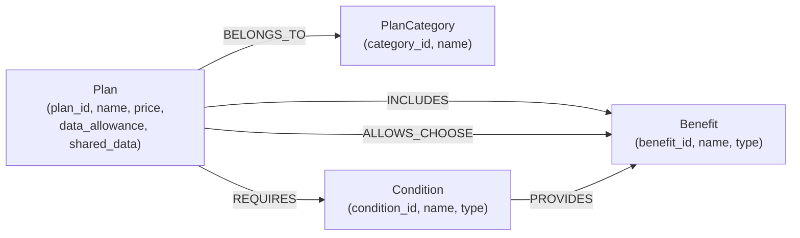

# Graph Designer Agent 실습 — LG U+ 5G 요금제 GraphDB 스키마 설계

> **과목:** 프롬프트 엔지니어링
> **실습 목표:** Google AI Studio에서 Graph Designer Agent를 직접 구성하고, LG U+ 5G 요금제 데이터를 기반으로 GraphDB 스키마를 설계한다.

---

## 실습 개요

LG U+의 5G 요금제 데이터는 요금제(Plan), 부가서비스(Benefit), 가족결합(Family), 할인 조건이 복잡하게 얽혀 있습니다.
단순 RAG(검색)로는 요금제 간의 **관계**와 **조건**을 완벽하게 추론하기 어렵습니다.

이 실습에서는 **AI Studio에 Graph Designer Agent를 직접 구성**하고, 자연어 입력만으로 GraphDB 스키마를 자동 생성하는 과정을 실습합니다.

---

## 핵심 개념

| 개념 | 설명 | 예시 |
|------|------|------|
| **Node** | 엔티티(사물) | Plan, Benefit, Condition |
| **Edge** | 관계 (방향 있음) | `-[INCLUDES]->` |
| **Property** | 노드/엣지의 속성값 | price = 130,000 |
| **Spanner DDL** | 스키마 정의 언어 | `CREATE TABLE`, `CREATE PROPERTY GRAPH` |
| **Mermaid** | 그래프 시각화 문법 | `graph LR ...` |

---

## Step 1 — Agent 구성 (System Instruction)

Google AI Studio Playground에서 아래 System Instruction을 설정하여 Graph Designer Agent를 구성하였습니다.

- **Model:** Gemini 2.0 Flash
- **Temperature:** 0.3

### System Instruction

```
You are an expert GraphDB Schema Designer specializing in Google Cloud Spanner Property Graphs.

Your job:
When given any business data or requirements, you must:

1. **Extract Nodes** — Identify all entities with their properties
2. **Extract Edges** — Identify all relationships between entities with direction and labels
3. **Generate Spanner DDL** — Write CREATE TABLE and PROPERTY GRAPH statements
4. **Visualize** — Generate a Mermaid diagram of the graph structure

Output format (always follow this structure):

### 1. Graph Schema
**Nodes:**
- NodeName (property1, property2, ...)

**Edges:**
- NodeA -[RELATIONSHIP_LABEL]-> NodeB

### 2. Spanner DDL
CREATE TABLE ...
CREATE PROPERTY GRAPH ...

### 3. Mermaid Diagram
graph LR
  ...

### 4. Design Notes
- Explain key design decisions

Rules:
- Always use UPPER_SNAKE_CASE for edge labels
- Always use PascalCase for node names
- Ask for clarification only if the input is completely ambiguous
- Respond in Korean
```

---

## Step 2 — 테스트 1: 간단한 요구사항

### 입력

```
LG U+ 5G 요금제 상담 챗봇을 위한 그래프 DB 설계:

엔티티:
- 요금제(Plan): 이름, 가격, 데이터 제공량, 음성 제공량
- 요금제 카테고리(PlanCategory): 5G 단말기, 5G 프리미어 등
- 혜택(Benefit): OTT 서비스, 데이터 추가 등
- 가입 조건(Condition): 나이 제한, 약정 기간 등

관계:
- 요금제는 카테고리에 속함 (BELONGS_TO)
- 요금제는 여러 혜택을 포함 (INCLUDES)
- 요금제는 가입 조건을 요구 (REQUIRES)
```

### 출력 — 그래프 스키마

**Nodes:**
- Plan (plan_id, name, price, data_allowance, voice_allowance)
- PlanCategory (category_id, name)
- Benefit (benefit_id, name, type, description)
- Condition (condition_id, name, type, description)

**Edges:**
- Plan -[BELONGS_TO]-> PlanCategory
- Plan -[INCLUDES]-> Benefit
- Plan -[REQUIRES]-> Condition

### 분석
- 4개 노드, 3개 엣지의 기본 구조 생성
- 입력에 명시된 엔티티와 관계가 정확히 반영됨

---

## Step 3 — 테스트 2: 상세 요금제 데이터 (스키마 확장)

### 입력

```
[내부용] LG 유플러스 5G 요금제
개정일: 2024년 5월 22일

### 1. 5G 시그니처
- 월 이용료: 130,000원 / 데이터: 무제한
- 공유 데이터: 60GB + 60GB
- OTT 팩: 2개 선택 가능 (넷플릭스, 디즈니+, 웨이브 등)
- 스마트기기: 2회선 무료 / 로밍: 50% 할인
- 선택약정 할인: 25% / 카테고리: 5G 단말기

### 2. 5G 프리미어 슈퍼
- 월 이용료: 115,000원 / 데이터: 무제한
- 공유 데이터: 50GB + 50GB
- OTT 팩: 선택 가능 / 선택약정 할인: 25%
- 카테고리: 5G 프리미어

### 특별 혜택
- 나이 할인: 만 34세 이하, 추가 할인
- 가족 결합: 2회선 이상, 데이터 2배
- 선택약정: 24개월 약정, 월정액 25% 할인
```

### 출력 — 그래프 스키마

**Nodes:**
- Plan (plan_id, name, price, data_allowance, shared_data, roaming_discount)
- PlanCategory (category_id, name)
- Benefit (benefit_id, name, type, description)
- Condition (condition_id, name, type, description)

**Edges:**
- Plan -[BELONGS_TO]-> PlanCategory
- Plan -[INCLUDES]-> Benefit **(속성: count, is_free)**
- Plan -[REQUIRES]-> Condition

### 분석
- Plan 노드에 `shared_data`, `roaming_discount` 속성 추가 → 상세 데이터 반영
- **INCLUDES 엣지에 속성(count, is_free) 추가** → 엣지도 데이터를 가질 수 있음을 확인
- OTTService, AgeDiscount 노드는 Benefit으로 통합 처리됨

---

## Step 4 — 테스트 3: 자연어로 스키마 반복 개선

### 입력

```
다음 기능들을 기존 스키마에 추가해주세요:

1. 만 34세 이하 할인 혜택 구조를 설계해줘
   → 나이 조건과 할인 혜택 간의 관계 추가

2. 가족 결합 시 데이터 2배 제공 조건도 포함해
   → 가족 결합 조건과 데이터 보너스 관계 추가

3. OTT 서비스별로 어떤 요금제에서 선택 가능한지 관계를 명확히 해줘
   → OTT 서비스와 요금제 간의 다대다 관계 추가
```

### 출력 — 최종 그래프 스키마

**Nodes:**
- Plan (plan_id, name, price, data_allowance, shared_data, roaming_discount)
- PlanCategory (category_id, name)
- Benefit (benefit_id, name, type, description)
- Condition (condition_id, name, type, description)

**Edges:**
- Plan -[BELONGS_TO]-> PlanCategory
- Plan -[INCLUDES]-> Benefit (속성: count, is_free)
- Plan -[REQUIRES]-> Condition
- Plan -[ALLOWS_CHOOSE]-> Benefit (주로 OTT 서비스 혜택)
- Condition -[PROVIDES]-> Benefit (조건 충족 시 제공되는 혜택)

### 분석
- **ALLOWS_CHOOSE 엣지 추가:** OTT 선택권을 별도 관계로 표현
- **Condition -[PROVIDES]-> Benefit 추가:** "조건을 충족하면 혜택이 제공된다"는 인과 관계 표현
  - 나이조건(34세이하) → 할인혜택
  - 가족결합조건 → 데이터2배혜택

---

## 최종 그래프 시각화 (Mermaid)



> Mermaid 시각화 확인: [mermaid.live](https://mermaid.live) 에 위 코드 붙여넣기

---

## 검증 결과

| 항목 | 결과 |
|------|------|
| 모든 엔티티가 노드로 추출되었는가? | ✅ |
| 관계(엣지)가 올바른 방향으로 정의되었는가? | ✅ |
| Spanner DDL 문법이 작성되었는가? | ✅ |
| Mermaid 다이어그램이 출력되었는가? | ✅ |
| 특별 혜택과 조건이 스키마에 반영되었는가? | ✅ |

---

## 테스트 1 → 3 비교 요약

| 항목 | 테스트 1 | 테스트 2 | 테스트 3 |
|------|---------|---------|---------|
| 노드 수 | 4개 | 4개 (+속성 증가) | 4개 |
| 엣지 수 | 3개 | 3개 (+엣지 속성) | 5개 |
| 엣지 속성 | 없음 | count, is_free | count, is_free |
| 인과 관계 표현 | 없음 | 없음 | PROVIDES 추가 |

**핵심 인사이트:** 입력 데이터가 풍부해질수록(테스트 1→2→3) Agent가 더 정교한 스키마를 생성한다. 이것이 **컨텍스트 엔지니어링**의 핵심이다.

---

## 배운 점

1. **프롬프트 엔지니어링:** System Instruction으로 AI에게 역할(Graph Designer)을 부여하면 전문가 수준의 결과물이 나온다.
2. **컨텍스트 엔지니어링:** 입력 정보가 풍부할수록 결과가 정교해진다. "무엇을 넣느냐"가 결과의 질을 결정한다.
3. **GraphDB 스키마:** 노드(엔티티)와 엣지(관계)로 복잡한 실세계 데이터를 표현할 수 있다. 엣지 자체도 속성을 가질 수 있다.
4. **반복 개선:** 자연어로 "이 관계 추가해줘"라고 요청하는 것만으로 스키마를 점진적으로 발전시킬 수 있다.

---

## Step 5 — 실제 질문으로 스키마 검증

설계한 스키마가 실제 챗봇 질문을 처리할 수 있는지 검증하였습니다.

### 테스트 질문

```
위에서 설계한 스키마를 기반으로 다음 질문에 답해줘:
"나는 만 30살이고, 넷플릭스를 무료로 쓰고 싶어.
가장 저렴한 요금제는 뭐야?"
```

### Agent 답변 요약

챗봇이 질문에서 3가지 조건을 추출하여 GQL 쿼리를 자동 생성:

| 추출된 조건 | 그래프 탐색 경로 |
|------------|----------------|
| 만 30살 | Condition(만 34세 이하) -[PROVIDES]-> Benefit(청년할인) |
| 넷플릭스 무료 | Plan -[ALLOWS_CHOOSE]-> Benefit(넷플릭스) |
| 가장 저렴한 | price ASC 정렬 |

### 생성된 GQL 쿼리

```sql
-- 1단계: 넷플릭스를 선택할 수 있는 요금제 찾기 (가격 오름차순)
SELECT plan_name, price
FROM GRAPH_TABLE(LguplusPlanGraph
  MATCH (p:Plan)-[r:INCLUDES|ALLOWS_CHOOSE]->(b:Benefit {name: '넷플릭스'})
  WHERE (LABELS(r) = 'INCLUDES' AND r.is_free = TRUE) OR LABELS(r) = 'ALLOWS_CHOOSE'
  COLUMNS(p.name AS plan_name, p.price AS price)
)
ORDER BY price ASC;

-- 2단계: 나이 조건 충족 시 추가 혜택 확인
SELECT condition_name, benefit_name
FROM GRAPH_TABLE(LguplusPlanGraph
  MATCH (p:Plan {name: '5G 프리미어 슈퍼'})-[:REQUIRES]->(c:Condition)
  OPTIONAL MATCH (c)-[:PROVIDES]->(b:Benefit)
  COLUMNS(c.name AS condition_name, b.name AS benefit_name)
);
```

### 최종 챗봇 답변

> "만 30살이시군요! 넷플릭스를 무료로 이용할 수 있는 가장 저렴한 요금제는 **5G 프리미어 슈퍼** (월 115,000원)입니다.
> 고객님은 만 34세 이하에 해당하셔서 **청년 추가 할인** 혜택을 받을 수 있고,
> 선택약정 할인(25%)까지 더하면 훨씬 저렴하게 이용 가능합니다."

### 검증 결과

테스트 3에서 설계한 `Condition -[PROVIDES]-> Benefit` 엣지가 실제 질문에서 작동함을 확인:
- 나이 조건(만 34세 이하) → 청년 할인 혜택 자동 연결
- 단순 검색(RAG)으로는 이 다중 조건 추론이 어렵지만, GraphDB 스키마를 통해 가능해짐
