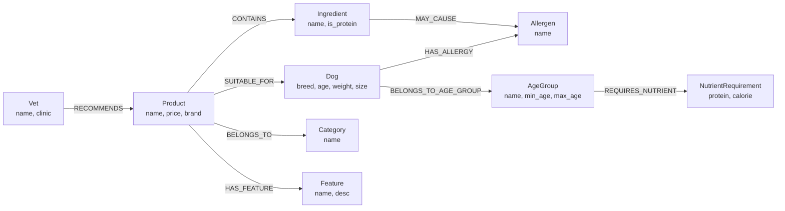

# my_doggy — 강아지 용품/식품 GraphDB 스키마 설계

> **과목:** 프롬프트 엔지니어링
> **실습 목표:** Google AI Studio에서 Graph Designer Agent를 활용하여 강아지 맞춤형 추천 챗봇을 위한 GraphDB 스키마를 설계한다.

---

## 실습 개요

강아지 용품/식품 추천은 **품종 + 나이 + 알레르기 + 카테고리** 등 복잡한 조건이 동시에 연결되어야 합니다.
단순 RAG(검색)로는 "3살 말티즈, 닭고기 알레르기인 강아지에게 맞는 간식"을 정확히 추론하기 어렵습니다.
이 실습에서는 GraphDB 스키마를 설계하여 이 문제를 해결합니다.

---

## 핵심 개념

| 개념 | 설명 | 이번 예시 |
|------|------|---------|
| **Node** | 엔티티(사물) | Dog, Product, Ingredient, Allergen |
| **Edge** | 관계 (방향 있음) | `-[MAY_CAUSE]->`, `-[HAS_ALLERGY]->` |
| **Property** | 노드/엣지 속성값 | breed="말티즈", age=3 |
| **다중 조건** | 여러 노드를 연결해 추론 | 품종+나이+알레르기 동시 처리 |
| **인과 관계** | 원인→결과 엣지 | 성분 -[MAY_CAUSE]-> 알레르기 |

---

## Step 1 — Agent 구성 (System Instruction)

- **Platform:** Google AI Studio Playground
- **Model:** Gemini 2.0 Flash
- **Temperature:** 0.3

### System Instruction

```
You are an expert GraphDB Schema Designer specializing in Google Cloud Spanner Property Graphs.

Your job:
When given any business data or requirements, you must:

1. **Extract Nodes** — Identify all entities with their properties
2. **Extract Edges** — Identify all relationships between entities with direction and labels
3. **Generate Spanner DDL** — Write CREATE TABLE and PROPERTY GRAPH statements
4. **Visualize** — Generate a Mermaid diagram of the graph structure

Output format (always follow this structure):

### 1. Graph Schema
**Nodes:**
- NodeName (property1, property2, ...)

**Edges:**
- NodeA -[RELATIONSHIP_LABEL]-> NodeB

### 2. Spanner DDL
CREATE TABLE ...
CREATE PROPERTY GRAPH ...

### 3. Mermaid Diagram
graph LR
  ...

### 4. Design Notes
- Explain key design decisions

Rules:
- Always use UPPER_SNAKE_CASE for edge labels
- Always use PascalCase for node names
- Ask for clarification only if the input is completely ambiguous
- Respond in Korean
```

---

## Step 2 — 테스트 1: 기본 구조

### 입력

```
강아지 용품/식품 추천 챗봇을 위한 그래프 DB 설계:

엔티티:
- 강아지(Dog): 품종, 나이, 체중, 크기(소/중/대형)
- 상품(Product): 이름, 가격, 카테고리, 브랜드
- 성분(Ingredient): 성분명, 단백질원 여부
- 알레르기(Allergen): 알레르기 유발 성분명
- 카테고리(Category): 사료, 간식, 장난감, 용품

관계:
- 상품은 카테고리에 속함 (BELONGS_TO)
- 상품은 성분을 포함함 (CONTAINS)
- 성분은 알레르기를 유발할 수 있음 (MAY_CAUSE)
- 상품은 특정 강아지에게 적합함 (SUITABLE_FOR)
- 강아지는 알레르기를 가짐 (HAS_ALLERGY)
```

### 출력 — 그래프 스키마

**Nodes:** Dog, Product, Ingredient, Allergen, Category (5개)

**Edges:**
- Product -[BELONGS_TO]-> Category
- Product -[CONTAINS]-> Ingredient
- Ingredient -[MAY_CAUSE]-> Allergen
- Product -[SUITABLE_FOR]-> Dog (속성: reason)
- Dog -[HAS_ALLERGY]-> Allergen

### 분석
- 5개 노드, 5개 엣지의 기본 구조 생성
- SUITABLE_FOR 엣지에 reason 속성 추가 — 엣지도 데이터를 가질 수 있음

---

## Step 3 — 테스트 2: 상세 상품 데이터

### 입력

```
### 로얄캐닌 말티즈 어덜트
- 카테고리: 사료 / 가격: 45,000원 (1.5kg)
- 대상: 말티즈 전용, 성견(1세 이상), 소형견
- 주요 성분: 닭고기, 쌀, 옥수수, 비트펄프
- 알레르기 유발 가능: 닭고기, 옥수수
- 특징: 구강 건강, 피부/모질 관리

### 네츄럴발란스 고구마&오리
- 카테고리: 사료 / 가격: 38,000원 (1.5kg)
- 주요 성분: 오리고기, 고구마 (닭고기 무첨가)
- 알레르기 유발 가능: 없음

### 지위픽 연어 져키
- 카테고리: 간식 / 가격: 12,000원
- 주요 성분: 연어 100% / 알레르기 유발: 없음
- 특징: 오메가3, 관절 건강

### 퍼피아 치킨 스틱
- 카테고리: 간식 / 가격: 8,000원
- 주요 성분: 닭고기 80% / 알레르기 유발: 닭고기
```

### 출력 — 그래프 스키마

**Nodes:** Dog, Product, Ingredient, Allergen, Category, **Feature** (6개)

**Edges:**
- Product -[BELONGS_TO]-> Category
- Product -[CONTAINS]-> Ingredient
- Ingredient -[MAY_CAUSE]-> Allergen
- Product -[SUITABLE_FOR]-> Dog (속성: reason)
- Dog -[HAS_ALLERGY]-> Allergen
- Product -[HAS_FEATURE]-> Feature **(추가)**

### 분석
- **Feature 노드 추가:** 구강 건강, 피부/모질 관리, 오메가3 등을 노드화
- "피부 건강에 좋은 사료 추천해줘" 같은 특징 기반 검색 가능
- Product에 weight_kg 속성 추가

---

## Step 4 — 테스트 3: 자연어로 스키마 확장

### 입력

```
다음 조건들을 스키마에 추가해주세요:

1. 강아지 나이별 영양 요구사항을 추가해줘
   → 퍼피(0~1세), 성견(1~10세), 노견(10세 이상)

2. 수의사 추천 여부 관계를 추가해줘
   → Vet -[RECOMMENDS]-> Product

3. "3살 말티즈, 닭고기 알레르기" 같은
   개인화 질문이 가능하도록 설계해줘
```

### 출력 — 최종 그래프 스키마

**Nodes:** Dog, Product, Ingredient, Allergen, Category, Feature, **AgeGroup, NutrientRequirement, Vet** (9개)

**Edges:**
- Product -[BELONGS_TO]-> Category
- Product -[CONTAINS]-> Ingredient
- Ingredient -[MAY_CAUSE]-> Allergen
- Product -[SUITABLE_FOR]-> Dog (속성: reason)
- Dog -[HAS_ALLERGY]-> Allergen
- Product -[HAS_FEATURE]-> Feature
- Dog -[BELONGS_TO_AGE_GROUP]-> AgeGroup **(추가)**
- AgeGroup -[REQUIRES_NUTRIENT]-> NutrientRequirement **(추가)**
- Vet -[RECOMMENDS]-> Product (속성: reason) **(추가)**

### 분석
- **연령 체인:** Dog → AgeGroup → NutrientRequirement ("노견에게 필요한 영양은?" 추론 가능)
- **수의사 추천:** 신뢰도 높은 추천 경로 추가
- **9개 노드, 9개 엣지**로 확장 — 테스트 1 대비 노드 2배 증가

---

## 최종 그래프 시각화 (Mermaid)



> Mermaid 시각화 확인: [mermaid.live](https://mermaid.live) 에 위 코드 붙여넣기

---

## Step 5 — 실제 질문으로 스키마 검증

### 테스트 질문

```
위에서 설계한 스키마를 기반으로 다음 질문에 답해줘:
"우리 강아지는 3살 말티즈이고 닭고기 알레르기가 있어.
 먹을 수 있는 간식을 추천해줘"
```

### 챗봇이 추출한 조건

| 조건 | 그래프 탐색 경로 |
|------|----------------|
| 3살 말티즈 | Dog (breed=말티즈, age=3) |
| 닭고기 알레르기 | Dog -[HAS_ALLERGY]-> Allergen(닭고기) |
| 간식 카테고리 | Product -[BELONGS_TO]-> Category(간식) |
| 알레르기 제외 | NOT EXISTS: Product -[CONTAINS]-> Ingredient -[MAY_CAUSE]-> Allergen(닭고기) |

### 생성된 GQL 쿼리

```sql
-- 닭고기 알레르기 제외 + 간식 카테고리 필터링
SELECT product_name, price, brand
FROM GRAPH_TABLE(DogProductGraph
  MATCH (p:Product)-[:BELONGS_TO]->(c:Category {name: '간식'})
  WHERE NOT EXISTS (
    MATCH (p)-[:CONTAINS]->(i:Ingredient)-[:MAY_CAUSE]->(a:Allergen {name: '닭고기'})
  )
  COLUMNS(p.name AS product_name, p.price AS price, p.brand AS brand)
)
ORDER BY price ASC;
```

### 최종 챗봇 답변

> "3살 말티즈이고 닭고기 알레르기가 있는 우리 강아지를 위해 추천해 드릴게요!
>
> **추천: 지위픽 연어 져키 (12,000원)**
> 연어 100%로 만들어져 닭고기 성분이 전혀 없어 안심하고 먹이실 수 있습니다.
> 오메가3가 풍부하여 관절 건강에도 도움이 됩니다.
>
> ※ 퍼피아 치킨 스틱은 닭고기 80% 함유로 제외되었습니다."

### 검증 포인트

- **3단계 경로 탐색:** Product → CONTAINS → Ingredient → MAY_CAUSE → Allergen
- **NOT EXISTS 패턴:** 알레르기 유발 상품 자동 제외
- **단순 검색 불가:** 이 다중 조건 추론은 GraphDB 없이 불가능

---

## 테스트 1 → 3 비교 요약

| 항목 | 테스트 1 | 테스트 2 | 테스트 3 |
|------|---------|---------|---------|
| 노드 수 | 5개 | 6개 | **9개** |
| 엣지 수 | 5개 | 6개 | **9개** |
| 신규 노드 | - | Feature | AgeGroup, NutrientRequirement, Vet |
| 신규 엣지 | - | HAS_FEATURE | BELONGS_TO_AGE_GROUP, REQUIRES_NUTRIENT, RECOMMENDS |

---

## 배운 점

1. **프롬프트 엔지니어링:** System Instruction으로 AI에게 역할(Graph Designer)을 부여하면 전문가 수준의 스키마가 자동 생성된다.
2. **컨텍스트 엔지니어링:** 입력 데이터가 풍부할수록(테스트 1→2→3) 스키마가 더 정교해진다.
3. **GraphDB 강점:** 노드와 엣지로 복잡한 관계를 표현하면, 다중 조건 추론이 가능해진다.
4. **NOT EXISTS 패턴:** 제외 조건(알레르기 유발 성분)을 그래프 경로로 표현할 수 있다.
5. **인과 관계:** 성분 -[MAY_CAUSE]-> 알레르기처럼 원인-결과를 엣지로 표현하는 것이 GraphDB의 핵심이다.
